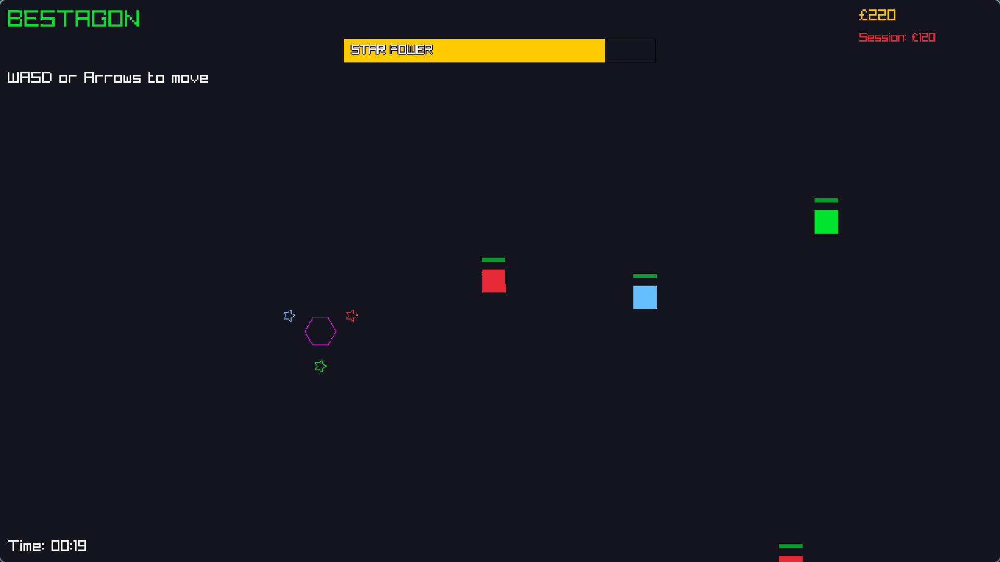

# Bestagon

Bestagon is now written in Odin using the built-in Raylib vendor package.

## Core mechanics

Bestagon the hexagon fights evil squares with three magic stars. He can only fight while star power lasts. Squares of a given color can only be damaged by a matching star color. Enemies get tougher over time, and defeating them earns currency for upgrades.



## Run

Make sure Odin is installed, then run:

```bash
odin run .
```

## Controls

Bestagon is keyboard-only by design (no mouse required).
