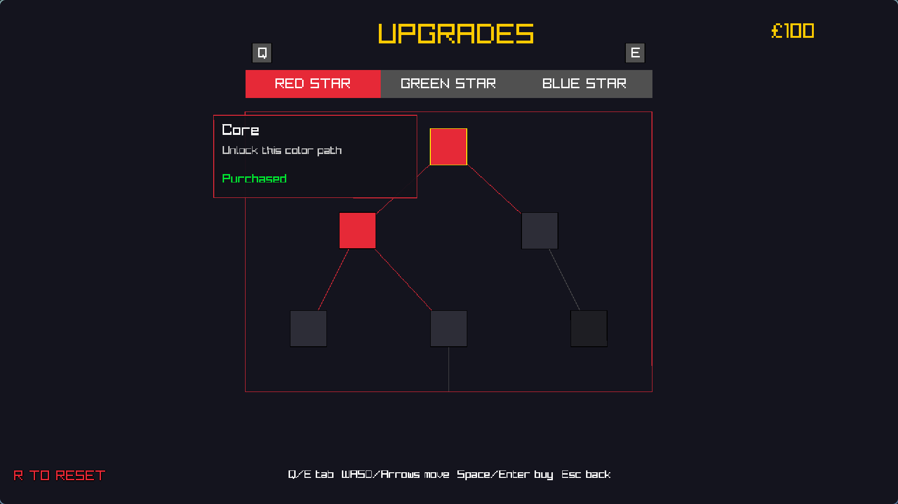
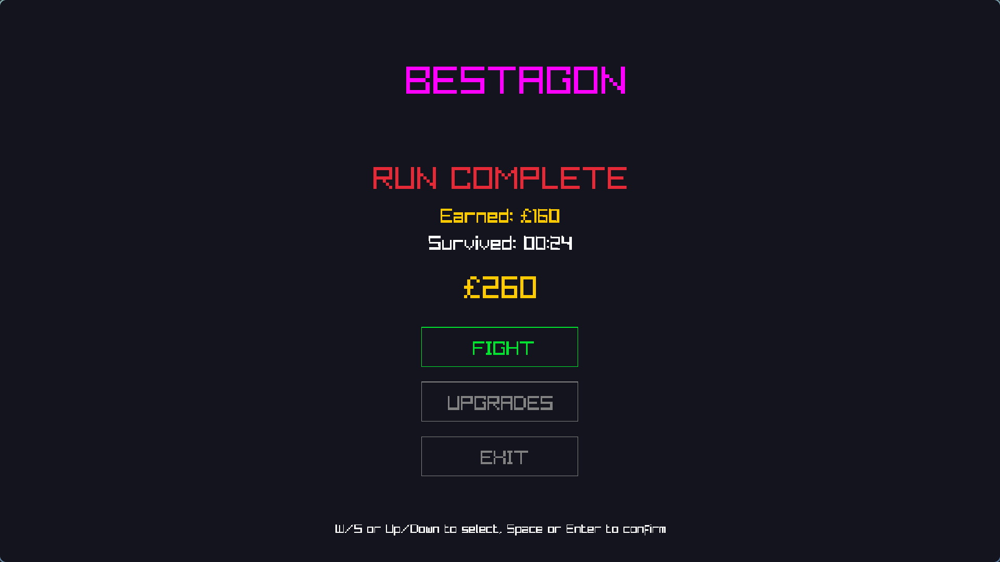

# Bestagon

Bestagon is a simple keyboard only game in Odin using the built-in Raylib vendor package.

The game is by design:
- asset free (all raylib rendered)
- heap allocation free (stack only)

## Core mechanics

Bestagon the hexagon fights evil squares with three magic stars. He can only fight while star power lasts. Squares of a given color can only be damaged by a matching star color. Enemies get tougher over time, and defeating them earns currency for upgrades.






## Run

Make sure Odin is installed, then run:

```bash
odin run src
```

## WASM build

Other than odin, also `emscripten` (emcc) is needed on path. On macOS:

```bash
brew install emscripten
```

You can build the WASM version with:

```bash
bash build_web.sh
```

And serve it with an example simple python server (python3 required on path) with:

```bash
bash run_web.sh
```
